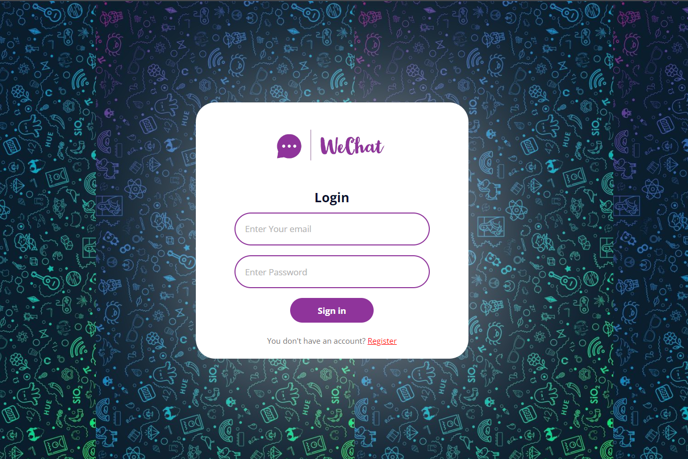

# 💬 WeChat : a Realtime based Chat Application

## 🔰 About
### * WeChat is a realtime based chat application for users where user can chat with different registered users.

## ⚙️ Tech Stack Used
- [React JS](https://reactjs.org/) (States, Effects, Hooks, Props, Function Structure, JSX etc.)
- [SASS](https://sass-lang.com/) (using SCSS syntax and mixins for designing)
- [Firebase](https://firebase.google.com/) (For Backend Connectivity with login Authentication and Firestore Database)

## 🌟 Features
- User can Login/Register on WeChat by just entering first name, email, password and choosing an Avatar.
- User can chat with differnt users by just searching the user name of other person.
- You can Send Messages, Emojis and also send Images(< 300kb).
- No other user can see the chat of between other 2 users.
- Application is design using SASS framework and it is Fully Responsive.
- Firebase Authentication is used for Login Activity.
- All User and Chat Data is Stored in the Firestore Database.

## 🔗 Links
### * [Source Code](https://github.com/Vikas350/WeChat)
### * Live Link - [WeChat](https://vikas-wechat.netlify.app/)

## 🔶 Highlights
- Register Page

- Login Page

- Chat Homepage

- Fully Responsive

## 📄 Credit
- Vikas Kushwaha
- Connect with me [LinkedIn](https://linkedin.com/in/vikas-kushwaha-165b95204)

